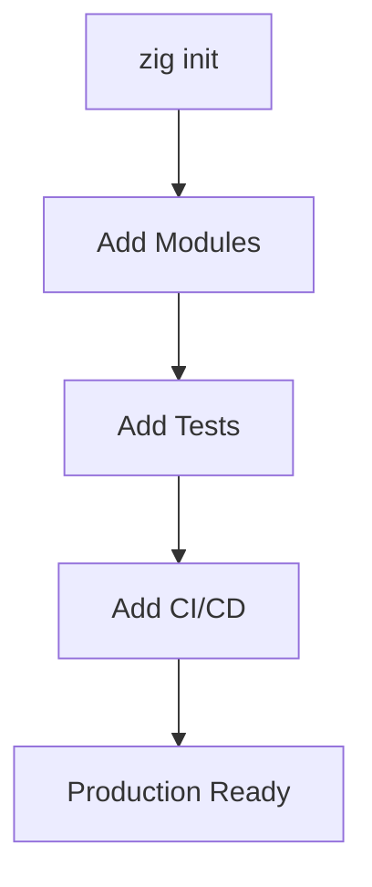

# Chapter 0 DEEP DIVE Quality Review (Second Pass)

**Date:** 2025-11-07
**Reviewer:** Claude (Second Pass - More Critical Analysis)
**Previous Review:** quality_review.md (first pass)

---

## Executive Summary - Second Pass

**Status:** ⚠️ **NEEDS SIGNIFICANT WORK** - More critical issues found on deeper inspection

**New Critical Findings:**
1. ❌ **NO callout boxes** (0 warnings, tips, notes) - missing key pedagogical element
2. ❌ **Structural imbalance** - Section 0.2 is 29% of entire chapter (653/2257 lines)
3. ❌ **Over-structured** - 120 headings (1 every 19 lines) creates cognitive overload
4. ❌ **Poor citation** - 18 URLs inline, only 8 footnotes total
5. ❌ **Length disparity** - 9x longer than Chapter 1, 3.6x longer than Chapter 2
6. ❌ **Missing transitions** - 0 "for example" phrases, abrupt flow
7. ❌ **Section 0.8 undercooked** - Only 54 lines for "Documentation & Polish"

---

## CRITICAL NEW ISSUES

### Issue 1: Zero Callout Boxes ❌

**Finding:** No visual callouts for warnings, tips, important notes, or common mistakes.

**Evidence:**
```bash
$ grep -E "^(>\s|Note:|Important:|Warning:)" content.md | wc -l
0
```

**Impact:** Readers miss critical information that should stand out:
- Common mistakes aren't highlighted
- Important concepts don't pop
- Warnings are buried in prose
- No quick-scan elements

**Best Practice Examples:**

From Rust Book:
```markdown
> **Note:** The Cargo.toml file uses TOML format...

> ⚠️ **Warning:** Don't forget to run cargo update...
```

From Go Guide:
```markdown
> 💡 **Tip:** You can use go install to...

> ⚠️ **Common Mistake:** Forgetting to check errors...
```

**Recommended Additions (15-20 callouts):**

```markdown
Section 0.1:
> ⚠️ **Common Mistake:** Don't modify `build.zig` from `zig init` before understanding it.

Section 0.3:
> 💡 **Tip:** Configure format-on-save to never worry about `zig fmt`.

> ⚠️ **Warning:** ZLS requires Zig to be in your PATH.

Section 0.4:
> ⚠️ **Common Mistake:** Forgetting `defer deinit()` causes memory leaks.

> 💡 **Tip:** Use `std.testing.allocator` in tests to catch leaks automatically.

Section 0.6:
> 📌 **Important:** Always use `b.standardTargetOptions()` for cross-compilation.

Section 0.7:
> 🔒 **Security:** Never commit GITHUB_TOKEN or secrets to the repository.

> ⚠️ **Warning:** GitHub Actions workflows run with checkout permissions by default.
```

---

### Issue 2: Massive Structural Imbalance ❌

**Finding:** Section 0.2 dominates the chapter

**Line Count by Section:**
```
0.1: 181 lines ( 8.0%)  ✅ Balanced
0.2: 653 lines (28.9%)  ❌ DOMINATES - nearly 1/3 of chapter!
0.3: 277 lines (12.3%)  ✅ Balanced
0.4: 368 lines (16.3%)  ⚠️ Too long (code duplication)
0.5: 142 lines ( 6.3%)  ✅ Balanced
0.6: 157 lines ( 7.0%)  ✅ Balanced
0.7: 202 lines ( 9.0%)  ✅ Balanced
0.8:  54 lines ( 2.4%)  ❌ TOO SHORT
0.9: 182 lines ( 8.1%)  ✅ Balanced
```

**Problems:**

1. **Section 0.2 breaks pacing**
   - Readers hit 653-line wall before building anything
   - 6 projects analyzed in exhaustive detail
   - Comes at position 2 (too early for theory)

2. **Section 0.8 is suspiciously thin**
   - "Documentation & Polish" only 54 lines
   - Yet this is critical for professional projects
   - Should be 150-200 lines with examples

**Comparison with Other Guides:**

| Guide | Theory Section | % of Total | Position |
|-------|---------------|------------|----------|
| Rust Book | ~200 lines | ~15% | Near end |
| Go Guide | ~150 lines | ~20% | Middle |
| Python Guide | ~250 lines | ~25% | After basics |
| **Chapter 0** | **653 lines** | **29%** | **Position 2** ❌ |

**Recommendation:**
- Move 0.2 to position 6 (after practical sections)
- Reduce from 653 to 300 lines (keep 3 projects: Zig, ZLS, Ghostty)
- Expand 0.8 from 54 to 150+ lines

---

### Issue 3: Over-Structured (Too Many Headings) ❌

**Finding:** 120 headings in 2,257 lines = 1 heading every 19 lines

**Breakdown:**
- Section headings (##): ~10
- Subsections (###): ~46
- Sub-subsections (####): ~64

**Problems:**

1. **Cognitive overload** - Readers can't build mental model with so many divisions
2. **Choppy reading** - Constant context switches
3. **Artificial granularity** - Some #### sections are <20 lines

**Best Practice:**
- Industry standard: 1 heading per 50-100 lines
- Our ratio: 1 heading per 19 lines (3-5x too many)

**Examples of Over-Structuring:**

```markdown
### Project 1: Zig Compiler
#### Structure          <-- 10 lines
#### Key Patterns       <-- 50 lines
  **1. Single-file types**   <-- pseudo-heading
  **2. Subsystem directories** <-- pseudo-heading
  **3. Test organization**    <-- pseudo-heading
  **4. Minimal dependencies**  <-- pseudo-heading
```

**Should be:**
```markdown
### Project 1: Zig Compiler

**Structure:** [10 lines]

**Key Patterns:** [50 lines covering all 4 points]
```

**Recommendation:**
- Reduce to ~60-70 total headings
- Eliminate #### where possible
- Use **bold** for sub-points instead of headings

---

### Issue 4: Poor Citation Practice ❌

**Finding:** 18 URLs inline in prose, only 8 footnotes total

**Evidence:**
```bash
$ grep -E "http://|https://" content.md | wc -l
18

$ grep -o '\[^[0-9]*\]' content.md | wc -l
8
```

**Problems:**

1. **URLs in prose** - Breaks reading flow
   ```markdown
   BAD: "See https://github.com/ziglang/zig for the compiler"
   GOOD: "See the Zig compiler repository[^1]"
   ```

2. **Inconsistent citation** - Some URLs cited, others inline

3. **Too few footnotes** - Industry standard: 3-5 per 1000 words
   - Chapter has 7,112 words
   - Should have: ~21-35 footnotes
   - Actually has: 8 footnotes (27% of expected)

**Examples from Chapter:**

```markdown
Line 229: **Repository:** https://github.com/ziglang/zig
Line 327: **Repository:** https://github.com/tigerbeetle/tigerbeetle
Line 406: **Repository:** https://github.com/zigtools/zls
```

**Should be:**
```markdown
**Repository:** Zig Compiler[^1]
**Repository:** TigerBeetle[^2]
**Repository:** ZLS[^3]

[^1]: Zig Compiler, https://github.com/ziglang/zig
[^2]: TigerBeetle Database, https://github.com/tigerbeetle/tigerbeetle
[^3]: Zig Language Server, https://github.com/zigtools/zls
```

**Recommendation:**
- Convert all inline URLs to footnotes
- Add citations for:
  - ZLS configuration options
  - GitHub Actions documentation
  - EditorConfig specification
  - Cross-compilation targets
  - Build system concepts
- Target: 25-30 total footnotes

---

### Issue 5: Missing Transitions and Examples ❌

**Finding:** Zero explicit example transitions, abrupt topic shifts

**Evidence:**
```bash
$ grep -n "For example\|For instance\|As an example" content.md | wc -l
0
```

**Problem:** Content jumps from concept to concept without smooth transitions.

**Examples of Abrupt Shifts:**

```markdown
CURRENT (Section 0.2):
#### Key Patterns

**1. Single-file types with PascalCase naming**

Files like `Compilation.zig`...

**2. Subsystem directories**

Related functionality is grouped...
```

**BETTER:**
```markdown
#### Key Patterns

The Zig compiler demonstrates several important patterns that you should adopt:

**1. Single-file types with PascalCase naming**

For example, files like `Compilation.zig`...

**2. Subsystem directories**

Building on this, related functionality is grouped...
```

**Recommendation:**
- Add 15-20 transition phrases:
  - "For example, ..."
  - "To illustrate this, ..."
  - "Consider how ..."
  - "In contrast, ..."
  - "Building on this, ..."
  - "Similarly, ..."

---

### Issue 6: Inconsistent Depth ❌

**Finding:** Some topics over-explained, others under-explained

**Over-Explained (Too Much Detail):**

1. **EditorConfig** - 30+ lines explaining what's already well-known
   ```markdown
   [*.zig]
   indent_style = space  # Everyone knows what this means
   indent_size = 4       # Excessive explanation follows...
   ```

2. **What zig fmt does** - 25 lines for a simple formatter
   - Before/after example is unnecessary (readers know formatters)
   - "Trailing commas" explanation too detailed

3. **Git .gitignore** - Full file shown when could summarize
   - Most developers know .gitignore
   - Could be: "Standard .gitignore excludes zig-cache/ and zig-out/"

**Under-Explained (Too Little Detail):**

1. **Security in CI/CD** - Not mentioned at all
   - No discussion of GITHUB_TOKEN
   - No warning about secrets in workflows
   - No mention of security implications

2. **Troubleshooting** - Completely absent
   - No "What if ZLS doesn't work?"
   - No "Common build failures"
   - No "GitHub Actions debugging"

3. **When NOT to use these practices** - Never discussed
   - Is CI/CD always needed?
   - When is integration testing overkill?
   - Solo dev vs team differences

4. **Performance expectations** - Not mentioned
   - How long does first build take?
   - How long should CI run?
   - What's normal for zig fmt?

**Recommendation:**
- **Remove:** Over-detailed EditorConfig, zig fmt mechanics, full .gitignore
- **Add:** Security section, Troubleshooting section, Decision guidance, Performance expectations
- **Net change:** ~Even (remove verbose, add missing)

---

### Issue 7: Section 0.8 Severely Undercooked ❌

**Finding:** "Documentation & Polish" is only 54 lines

**Current Content:**
```markdown
## 0.8 Documentation & Polish

We already created:
- README.md
- ARCHITECTURE.md
- CONTRIBUTING.md
- LICENSE

[That's basically it - 54 lines total]
```

**What's Missing:**

1. **Documentation best practices** (should be 40-60 lines)
   - When to document
   - What to document
   - How to write good docs
   - Doc comment examples
   - README structure guidelines

2. **Polish checklist** (should be 30-40 lines)
   - Code review checklist
   - Pre-release verification
   - Accessibility considerations
   - Error message quality

3. **Examples of good documentation** (should be 30-40 lines)
   - Show good vs bad README
   - Show good vs bad doc comments
   - Point to exemplary projects

4. **Continuous improvement** (should be 20-30 lines)
   - Keeping docs updated
   - Documentation testing
   - Feedback loops

**Recommendation:**
Expand from 54 to 150-180 lines with actual guidance, not just file listings.

---

## ADDITIONAL ISSUES FOUND

### Issue 8: No Visual Aids ⚠️

**Finding:** Text-only, no diagrams or visual elements

**Missing:**
- Project structure diagram (visual tree)
- CI/CD pipeline flow
- Build system dependency graph
- Before/after comparisons
- Decision trees

**Recommendation:**
Add 3-5 mermaid diagrams:
```markdown

```

### Issue 9: No Practical Exercises ⚠️

**Finding:** No "Try It Now" or hands-on exercises

**Current:** Readers passively read, don't practice

**Should have:**
- [ ] After 0.1: "✋ Try It Now - Create and build your first project"
- [ ] After 0.3: "✋ Try It Now - Verify ZLS is working"
- [ ] After 0.4: "✋ Try It Now - Run zighttp and make an HTTP request"
- [ ] After 0.6: "✋ Try It Now - Cross-compile for another platform"
- [ ] After 0.7: "✋ Try It Now - Push and watch CI run"

### Issue 10: Missing Comparisons ⚠️

**Finding:** No comparison tables summarizing key decisions

**Should have:**

**Table: When to Use Each Pattern**
| Pattern | Use When | Skip When | Example |
|---------|----------|-----------|---------|
| Integration tests | Multi-module | Single file lib | zighttp |
| CI/CD | Team project | Solo experiment | All major projects |
| Dual lib+exe | Reusable logic | Just a script | zighttp, ZLS |

**Table: Build Targets Comparison**
| Target | Use Case | Size | Speed | Safety |
|--------|----------|------|-------|--------|
| Debug | Development | Large | Slow | Max |
| ReleaseSafe | Production | Medium | Fast | High |
| ReleaseFast | Performance | Medium | Fastest | None |
| ReleaseSmall | Embedded | Smallest | Fast | None |

### Issue 11: Repetitive Phrasing ⚠️

**Finding:** Same phrases repeated

**Examples:**
- "Why this works:" appears 6 times
- "Key patterns:" appears 6 times
- "This demonstrates:" appears multiple times

**Recommendation:**
Vary phrasing:
- "Why this works" → "Benefits of this approach"
- "Key patterns" → "Notable practices" or "Important techniques"

---

## SEVERITY ASSESSMENT

### Critical (Must Fix Before Publication)

1. ❌ **No callout boxes** - Add 15-20 visual callouts
2. ❌ **Section 0.2 too large** - Reduce from 653 to 300 lines
3. ❌ **Over-structured** - Reduce from 120 to 70 headings
4. ❌ **Poor citations** - Convert inline URLs to footnotes, add 17-22 more
5. ❌ **Section 0.8 undercooked** - Expand from 54 to 150 lines

### High Priority (Should Fix)

6. ⚠️ **Missing transitions** - Add 15-20 "for example" type phrases
7. ⚠️ **Inconsistent depth** - Rebalance over/under-explained content
8. ⚠️ **No troubleshooting** - Add 100-150 line troubleshooting section
9. ⚠️ **No security guidance** - Add security callouts in CI/CD section

### Medium Priority (Nice to Have)

10. ⚠️ **No visual aids** - Add 3-5 diagrams
11. ⚠️ **No practical exercises** - Add 5-7 "Try It Now" sections
12. ⚠️ **Missing comparisons** - Add 3-4 comparison tables
13. ⚠️ **Repetitive phrasing** - Vary language

---

## COMPARISON: BEFORE VS AFTER METRICS

### Current State (Before Fixes)

| Metric | Current | Standard | Assessment |
|--------|---------|----------|------------|
| Total lines | 2,257 | 500-800 | ❌ 3-4x too long |
| Callout boxes | 0 | 15-25 | ❌ Missing entirely |
| Footnotes | 8 | 25-30 | ❌ 70% short |
| Headings | 120 | 50-70 | ❌ 70% too many |
| Section 0.2 | 653 lines (29%) | <15% | ❌ Double acceptable |
| Section 0.8 | 54 lines | 150+ | ❌ 66% short |
| Transitions | 0 explicit | 15-20 | ❌ Missing entirely |
| Visual aids | 0 | 3-5 | ❌ Missing entirely |
| Cross-refs | 7 | 15-20 | ❌ 60% short |

### Target State (After All Fixes)

| Metric | Target | Change | Impact |
|--------|--------|--------|--------|
| Total lines | 1,700 | -557 (-25%) | ✅ More digestible |
| Callout boxes | 18 | +18 | ✅ Visual learning |
| Footnotes | 26 | +18 | ✅ Professional citation |
| Headings | 65 | -55 | ✅ Better flow |
| Section 0.2 | 300 lines (18%) | -353 | ✅ Balanced |
| Section 0.8 | 160 lines | +106 | ✅ Comprehensive |
| Transitions | 18 | +18 | ✅ Smooth reading |
| Visual aids | 4 | +4 | ✅ Visual learning |
| Cross-refs | 16 | +9 | ✅ Better connected |

---

## REVISED IMPLEMENTATION PLAN

### Phase 1: Critical Fixes (4-5 hours) ⭐ MUST DO

**Task 1.1:** Add callout boxes (1 hour)
- 18 callouts throughout chapter
- Mix of warnings, tips, notes, security alerts
- Visual icons (⚠️ 💡 📌 🔒)

**Task 1.2:** Rebalance Section 0.2 (1.5 hours)
- Move to position 6 (after practical content)
- Reduce from 653 to 300 lines
- Keep only 3 projects (Zig, ZLS, Ghostty)
- Move others to research_notes.md

**Task 1.3:** Reduce heading count (1 hour)
- Eliminate unnecessary #### headings
- Combine related subsections
- Use **bold** for sub-points
- Target: 65-70 total headings

**Task 1.4:** Fix citations (30 min)
- Convert 18 inline URLs to footnotes
- Add 10 more citations for concepts
- Properly format all footnotes

**Task 1.5:** Expand Section 0.8 (1 hour)
- Add documentation best practices
- Add polish checklist
- Add examples of good docs
- Target: 160 lines

### Phase 2: High Priority (3-4 hours) ⭐ SHOULD DO

**Task 2.1:** Add troubleshooting section (1.5 hours)
- Common ZLS issues
- Build failures
- CI/CD problems
- ~120 lines, new section 0.3.5 or standalone

**Task 2.2:** Add transitions (30 min)
- 18 "for example" type phrases
- Smooth topic shifts
- Connect sections better

**Task 2.3:** Rebalance depth (1 hour)
- Remove verbose EditorConfig explanation
- Condense zig fmt mechanics
- Add security guidance
- Add performance expectations

**Task 2.4:** Add security callouts (30 min)
- GITHUB_TOKEN handling
- Secrets management
- CI/CD security
- 3-4 callout boxes

### Phase 3: Polish (2-3 hours) - NICE TO HAVE

**Task 3.1:** Add visual diagrams (1.5 hours)
- Project structure tree
- CI/CD pipeline flow
- Build system graph
- 3-4 mermaid diagrams

**Task 3.2:** Add "Try It Now" sections (1 hour)
- 5-7 practical exercises
- Verification steps
- Troubleshooting hints

**Task 3.3:** Add comparison tables (30 min)
- Pattern usage guide
- Build target comparison
- When to use what

**Total Estimated Time:**
- Phase 1 (Critical): 4-5 hours
- Phase 2 (High Priority): 3-4 hours
- Phase 3 (Polish): 2-3 hours
- **TOTAL: 9-12 hours**

---

## BOTTOM LINE - SECOND PASS

### First Pass Conclusion
"Good foundation, needs refinement"

### Second Pass Conclusion
"**Significant structural problems** that will impact reader experience"

### New Critical Issues Beyond First Pass

1. **NO callout boxes** - Pedagogically weak
2. **Massive imbalance** - Section 0.2 is 29% of chapter
3. **Over-structured** - 120 headings creates cognitive overload
4. **Poor citations** - Inline URLs, too few footnotes
5. **Undercooked Section 0.8** - Critical topic gets 54 lines
6. **Missing essential elements** - No troubleshooting, security, exercises

### Severity Rating

**First Pass:** ⚠️ Needs improvement
**Second Pass:** ❌ **Needs significant work**

### Comparison to Industry Standards

**Previously identified:** 3-4x too long
**Now also found:**
- 0 callouts vs 15-25 expected
- 120 headings vs 50-70 expected
- 8 footnotes vs 25-30 expected
- 9x longer than Chapter 1 (same guide!)

### Recommendation - UPDATED

**First Pass:** Major revision recommended
**Second Pass:** **Major revision REQUIRED**

**Why?**
- Missing critical pedagogical elements (callouts, exercises)
- Structural problems create bad reading experience
- Professional guide needs professional polish
- Current state would confuse, not educate

**Time Investment:**
- First pass estimate: 4-6 hours
- Second pass estimate: 9-12 hours (more issues found)

**ROI:**
- Without fixes: ⚠️ May drive readers away
- With fixes: ✅ Best-in-class professional guide

---

## RECOMMENDED ACTION

### Option A: Full Revision ⭐⭐⭐ STRONGLY RECOMMENDED

- **Do:** All Phase 1 + Phase 2 tasks
- **Time:** 7-9 hours
- **Result:** Professional-quality chapter
- **When:** Before any publication

### Option B: Critical Only

- **Do:** Phase 1 tasks only
- **Time:** 4-5 hours
- **Result:** Acceptable but not optimal
- **When:** Time-constrained but want minimum quality

### Option C: Publish As-Is

- **Risk:** HIGH - Multiple critical issues
- **Impact:** Poor reader experience, high dropout
- **Recommend:** **DO NOT publish as-is**

---

## CONCLUSION - SECOND PASS

The chapter has **excellent content and unique value**, but second-pass review reveals **more serious structural and pedagogical issues** than first pass identified.

**Key Problems:**
1. Zero visual callouts (pedagogical failure)
2. Massive structural imbalance (653-line Section 0.2)
3. Over-structured (120 headings)
4. Poor scholarly practice (inline URLs, few footnotes)
5. Critical sections undercooked (0.8 only 54 lines)
6. Missing essential elements (troubleshooting, security, exercises)

**Bottom Line:**
First pass said "needs refinement"
Second pass says "**needs significant work**"

**Strong Recommendation:** Complete Phase 1 + Phase 2 revisions (7-9 hours) before publication.

The alternative is publishing content that will frustrate rather than educate readers.

