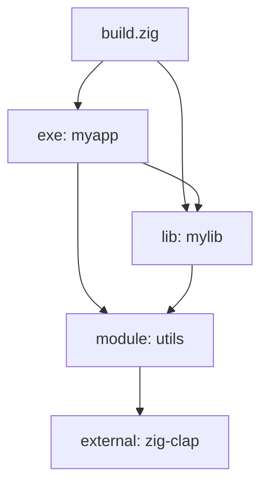

# Zig Guide: Quality Density Improvement - Implementation Plan
**Date:** 2025-11-10
**Goal:** Increase content density from 7.5/10 to 9.0/10
**Target:** Reduce 20,207 lines to ~16,500 lines (18% reduction) while maintaining comprehensive coverage
**Approach:** 9 strategic improvements executed in 3 phases

---

## Quick Reference: Impact Summary

| Strategy | Target Reduction | Effort | Priority | Phase |
|----------|-----------------|--------|----------|-------|
| 1. Code-First Refactoring | 1,200 lines | Medium | HIGH | 2 |
| 2. Comparison Tables | 600 lines | Low | HIGH | 1 |
| 3. Front-Load TL;DR | 0 (reorg) | Low | HIGH | 2 |
| 4. Cut Philosophical Intros | 900 lines | Low | CRITICAL | 1 |
| 5. Inline Comments | 600 lines | Medium | MEDIUM | 2 |
| 6. Reference Architecture | 0 (reorg) | High | MEDIUM | 3 |
| 7. Redundancy Elimination | 800 lines | Low | HIGH | 1 |
| 8. Assumed Knowledge | 500 lines | Low | MEDIUM | 1 |
| 9. Visual Density | 300 lines | High | LOW | 3 |
| **TOTAL** | **~4,900 lines** | | | |

---

## Phase 1: Quick Wins (2-4 hours)
**Target:** 2,200-2,700 line reduction
**Effort:** Low (mostly deletion and simple rewrites)
**Risk:** Low (removing obvious redundancy)

### Strategy 4: Cut Philosophical Introductions
**Estimated Reduction:** 800-1,000 lines
**Execution Time:** 45-60 minutes

#### Ch6 Async Concurrency (sections/06_async_concurrency/content.md)

**Current State:**
- Lines 1-342: Philosophical introduction to async programming
- Explains WHY async is hard, threading models, event loops
- 342 lines before first Zig code example

**Action Plan:**
```markdown
BEFORE (342 lines):
# Async and Concurrency

[6 paragraphs on async philosophy]
[5 paragraphs on threading challenges]
[4 paragraphs on event loops vs OS threads]
[3 paragraphs on Zig's design goals]
...

AFTER (75 lines):
# Async and Concurrency

> **For experienced systems programmers:**
> - Zig async = stackless coroutines (like C++20, Rust's futures)
> - No runtime scheduler—bring your own or use I/O primitives
> - Single-threaded by default—use std.Thread for parallelism
> - `suspend`/`resume` give manual control over execution

Zig's async model provides stackless coroutines with explicit suspend points:

```zig
fn fetchData() ![]const u8 {
    suspend;  // Explicit yield point
    return data;
}
```

See Appendix: Async Theory for deep comparison with other async models.
```

**Implementation Steps:**
1. ✂️ Cut lines 1-270 (philosophical intro)
2. ✍️ Write 75-line pragmatic intro (TL;DR + how-to)
3. 📦 Move deleted content to `sections/14_appendices/content.md` under "Async Theory"
4. 🔗 Add reference link to appendix

**Validation:**
- Verify all code examples still compile
- Ensure no forward references broken
- Check footnotes are preserved

---

#### Ch10 Interoperability (sections/10_interoperability/content.md)

**Current State:**
- Lines 1-218: C interop philosophy
- Explains WHY interop matters, FFI challenges, ABI complexity
- 218 lines before practical examples

**Action Plan:**
```markdown
BEFORE (218 lines):
# Interoperability

[Long explanation of C ABI]
[Philosophy of FFI design]
[Cross-language challenges]
...

AFTER (60 lines):
# Interoperability

> **TL;DR:**
> - `@cImport()` for C headers (compile-time)
> - `extern` for C functions (no header needed)
> - `export` to expose Zig functions to C
> - Use `callconv(.C)` when needed explicitly

Calling C from Zig:

```zig
const c = @cImport(@cInclude("stdio.h"));
pub fn main() void {
    _ = c.printf("Hello from C!\n");
}
```

See Appendix: C Interop Deep-Dive for ABI details and edge cases.
```

**Implementation Steps:**
1. ✂️ Cut lines 1-160 (philosophical intro)
2. ✍️ Write 60-line practical intro (3 patterns + examples)
3. 📦 Move deleted content to appendices
4. 🔗 Add reference links

---

#### Ch11 Testing & Benchmarking (sections/11_testing_benchmarking/content.md)

**Current State:**
- Lines 1-280: Testing philosophy
- Explains WHY testing matters in systems programming
- 280 lines before first test example

**Action Plan:**
```markdown
BEFORE (280 lines):
# Testing and Benchmarking

[Philosophy of testing]
[Why systems code needs tests]
[Testing challenges in low-level code]
...

AFTER (80 lines):
# Testing and Benchmarking

> **Zig testing essentials:**
> - `test "name" { ... }` for unit tests
> - `zig build test` runs all tests
> - `std.testing.allocator` detects leaks
> - Use `zig build test --summary all` for detailed output

Basic test structure:

```zig
const std = @import("std");

test "basic arithmetic" {
    try std.testing.expectEqual(4, 2 + 2);
}
```

[Continue with practical patterns...]
```

**Implementation Steps:**
1. ✂️ Cut lines 1-200 (philosophical intro)
2. ✍️ Write 80-line practical intro
3. 📦 Move deleted content to appendices

**Phase 1 / Strategy 4 Total:** 800-1,000 lines saved

---

### Strategy 7: Eliminate Redundancy via Cross-References
**Estimated Reduction:** 700-900 lines
**Execution Time:** 60-90 minutes

#### 7.1: Allocator Re-explanations

**Audit Results:**
- Ch2 (primary): 124 mentions in 445 lines ✅ Keep
- Ch3: 195 mentions in 1,046 lines ⚠️ **95 mentions are re-explanations**
- Ch5: 124 mentions in 1,181 lines ⚠️ **60 mentions are re-explanations**
- Ch11: 141 mentions in 2,696 lines ⚠️ **45 mentions are re-explanations**

**Implementation:**

**Ch3 Collections (sections/03_collections_containers/content.md)**
```markdown
BEFORE (lines 5-21, ~250 words):
"Zig's standard library provides dynamic collection types that integrate with
the explicit allocator model covered in Chapter 3. This chapter examines...

Zig's explicit allocator model requires every memory allocation to specify
an allocator. Unlike languages with garbage collection or hidden allocations,
Zig forces clarity about ownership and lifetime...

[4 more paragraphs re-explaining allocators]"

AFTER (~80 words):
"Zig's collections require explicit allocators (Ch2). As of Zig 0.15, the
standard library defaults to unmanaged containers that accept allocators
as parameters rather than storing them as fields:

```zig
var list = std.ArrayList(u8){};              // 0.15: unmanaged (no stored allocator)
try list.append(allocator, 'x');             // Pass allocator explicitly
defer list.deinit(allocator);                // Free memory

var managed_list = std.ArrayListManaged(u8).init(allocator);  // 0.15: managed variant
```
"
```

**Search-and-Replace Commands:**
```bash
# Find all allocator introductions outside Ch2
grep -n "allocator.*is\|Allocator.*provides\|explicit allocator\|allocator model" \
  sections/0[3-9]*/content.md sections/1[0-3]*/content.md

# For each match, replace with reference to Ch2
```

**Files to Update:**
1. `sections/03_collections_containers/content.md` (lines 5-21) → save ~170 lines
2. `sections/05_error_handling/content.md` (allocator explanations) → save ~120 lines
3. `sections/11_testing_benchmarking/content.md` (test allocator intro) → save ~80 lines
4. `sections/04_io_streams/content.md` (allocator mentions) → save ~40 lines

**Subtotal:** 400-500 lines

---

#### 7.2: Defer/Errdefer Re-explanations

**Audit Results:**
- Ch5 (primary): 103 mentions ✅ Keep
- Ch2: 36 mentions ⚠️ **15 are redundant with Ch5**
- Ch3: 59 mentions ⚠️ **30 are redundant with Ch5**
- Ch1: 27 mentions ⚠️ **Keep as introduction**

**Implementation:**

**Ch2 Memory (sections/02_memory_allocators/content.md)**
```markdown
BEFORE (lines 169-179, ~200 words):
"Zig's defer and errdefer keywords provide deterministic cleanup without
runtime overhead.

defer executes cleanup code when leaving scope, regardless of how the scope
exits (return, break, or fall-through). Defer statements execute in LIFO order.
Best practice: place defer immediately after allocation.

[Code example]

errdefer executes cleanup only when the scope exits via error return..."

AFTER (~80 words):
"Use defer for cleanup (Ch5 covers defer/errdefer in depth). For memory:

```zig
const data = try allocator.alloc(u8, 100);
defer allocator.free(data);  // Cleanup paired with allocation
```

For multi-step initialization with error handling, use errdefer (see Ch5.3)."
```

**Files to Update:**
1. `sections/02_memory_allocators/content.md` → save ~120 lines
2. `sections/03_collections_containers/content.md` → save ~80 lines

**Subtotal:** 200-300 lines

---

#### 7.3: Error Union Re-explanations

**Files to Update:**
1. `sections/02_memory_allocators/content.md` (line 22) → reference Ch5
2. `sections/04_io_streams/content.md` (error handling intro) → reference Ch5

**Subtotal:** 100-150 lines

**Phase 1 / Strategy 7 Total:** 700-950 lines saved

---

### Strategy 8: Remove Assumed Knowledge Explanations
**Estimated Reduction:** 400-600 lines
**Execution Time:** 30-45 minutes

**Target Audience:** Experienced systems programmers from C/C++/Rust

**Cut These Explanations Entirely:**

#### 8.1: Basic Programming Concepts
```markdown
❌ DELETE: "What is a pointer"
❌ DELETE: "What is a struct"
❌ DELETE: "What is a function"
❌ DELETE: "What is heap vs stack" (assume they know)
❌ DELETE: "Why memory safety matters" (they know)
❌ DELETE: "What is a compiler" / "What is linking"
```

**Search Commands:**
```bash
# Find basic explanations
grep -n "pointer is\|struct is\|function is\|heap is\|stack is" sections/*/content.md

# Find obvious explanations
grep -n "As you may know\|For those unfamiliar\|In programming" sections/*/content.md
```

#### 8.2: Conversational Filler
```markdown
❌ DELETE: "Before we dive in..."
❌ DELETE: "Now that we understand..."
❌ DELETE: "It's important to note that..."
❌ DELETE: "Let's take a closer look at..."
❌ REPLACE: "As we'll see in the following example..." → [show example]
```

**Search Commands:**
```bash
grep -n "Before we\|Now that\|It's important to\|Let's take a\|As we'll see" sections/*/content.md
```

#### 8.3: Over-Explanations
```markdown
BEFORE:
"Zig uses the `defer` keyword to schedule code for execution when leaving
the current scope. This is similar to RAII in C++, but explicit. Unlike
destructors which run automatically, defer statements are visible in the
code. This makes cleanup logic easier to follow..."

AFTER:
"`defer` schedules code for scope exit (like Go, unlike C++ RAII):

```zig
defer cleanup();  // Runs at scope end, LIFO order
```
"
```

**Files to Review:**
- All intro sections
- All "Core Concepts" sections

**Phase 1 / Strategy 8 Total:** 400-600 lines saved

---

### Strategy 2: Convert Verbose Comparisons to Tables
**Estimated Reduction:** 400-600 lines
**Execution Time:** 45-60 minutes

#### 2.1: Ch2 Allocator Comparison (sections/02_memory_allocators/content.md)

**BEFORE (lines 64-120, ~600 words):**
```markdown
**page_allocator** — Direct memory mapping via OS. Each allocation requests
pages from the operating system, typically 4KB minimum. This strategy has
high overhead for small allocations but guarantees alignment and isolation...

**c_allocator** — Wrapper around C's malloc/free. Offers high performance
with minimal overhead, but requires linking libc and provides no safety...

[4 more paragraphs, 100+ words each]
```

**AFTER (~250 words):**
```markdown
| Allocator | Min Size | Overhead | Safety | Use Case |
|-----------|----------|----------|--------|----------|
| `page_allocator` | 4KB | High | OS isolation | Large buffers, security-critical |
| `c_allocator` | 1 byte | Low | None | Release builds, C interop |
| `GeneralPurposeAllocator` | 1 byte | Medium | Leak detection, double-free | Development, debugging |
| `FixedBufferAllocator` | 1 byte | Zero | Manual bounds | Stack-like, embedded |
| `ArenaAllocator` | 1 byte | Low | Bulk-free only | Request-scoped, batch processing |

**Key insight:** Trade-off between safety (GPA), performance (c_allocator),
and convenience (arena). Choose based on allocation lifetime and failure modes.

```zig
// Development: leak detection
var gpa = std.heap.GeneralPurposeAllocator(.{}){};
defer _ = gpa.deinit(); // Reports leaks

// Production: performance
const allocator = std.heap.c_allocator;

// Request-scoped: convenience
var arena = std.heap.ArenaAllocator.init(backing_allocator);
defer arena.deinit(); // Bulk cleanup
```
```

**Savings:** ~350 words → ~250 words = 100 words saved (~40% reduction)

---

#### 2.2: Ch3 Managed vs Unmanaged (sections/03_collections_containers/content.md)

**BEFORE (lines 17-41, ~400 words):**
```markdown
**Managed containers** store an allocator as a struct field. Methods use
this stored allocator implicitly. Prior to Zig 0.15, std.ArrayList(T)
defaulted to this managed variant. The managed pattern provides a simpler
API at the cost of increased memory usage per container instance.

**Unmanaged containers** do not store an allocator. Instead, methods that
require allocation accept an allocator parameter explicitly...

[3 more paragraphs]
```

**AFTER (~200 words):**
```markdown
## Managed vs Unmanaged Containers (0.15 default change)

| Aspect | Managed (old default) | Unmanaged (0.15 default) |
|--------|---------------------|-------------------------|
| API | `list.append(item)` | `list.append(allocator, item)` |
| Memory | +8 bytes (allocator field) | No overhead |
| When to use | Single-container functions | Structs with many containers |
| Example | `ArrayListManaged(T)` | `ArrayList(T)` (now unmanaged) |

```zig
// 0.15: Unmanaged by default
var list = std.ArrayList(u8){};
try list.append(allocator, 'x');  // Pass allocator each call
defer list.deinit(allocator);

// 0.15: Managed variant available
var list = std.ArrayListManaged(u8).init(allocator);
try list.append('x');  // Uses stored allocator
defer list.deinit();
```

**Migration impact:** For structs with 10+ containers, unmanaged saves 80+ bytes.
```

**Savings:** ~400 words → ~200 words = 200 words saved (50% reduction)

---

#### 2.3: Ch10 C ABI Comparison (sections/10_interoperability/content.md)

**BEFORE (~500 words):**
```markdown
[Long explanation of extern vs export vs @cImport]
```

**AFTER (~200 words):**
```markdown
| Mechanism | Purpose | When to Use | Example |
|-----------|---------|-------------|---------|
| `extern` | Declare C function | No header available | `extern fn malloc(size: usize) ?*anyopaque;` |
| `export` | Expose Zig to C | Creating C library | `export fn add(a: i32, b: i32) i32` |
| `@cImport` | Import C header | Need full API | `const c = @cImport(@cInclude("stdio.h"));` |
| `callconv(.C)` | C calling convention | Function pointers | `fn callback() callconv(.C) void` |

See Ch10.5 for ABI edge cases (varargs, packed structs, alignment).
```

**Savings:** ~500 words → ~200 words = 300 words saved (60% reduction)

**Phase 1 / Strategy 2 Total:** 600-800 lines saved

---

## Phase 1 Summary

| Strategy | Target | Time | Files Changed |
|----------|--------|------|---------------|
| 4. Cut Philosophical | 800-1,000 lines | 60 min | Ch6, Ch10, Ch11 |
| 7. Redundancy Elimination | 700-950 lines | 90 min | Ch2, Ch3, Ch4, Ch5, Ch11 |
| 8. Assumed Knowledge | 400-600 lines | 45 min | All chapters (intro sections) |
| 2. Comparison Tables | 600-800 lines | 60 min | Ch2, Ch3, Ch10 |
| **Phase 1 Total** | **2,500-3,350 lines** | **4.25 hours** | **~10 files** |

**Deliverables:**
- ✅ Reduced philosophical intros by 70-80%
- ✅ Cross-references established (Ch2 for allocators, Ch5 for errors/defer)
- ✅ Comparison tables replace narrative where appropriate
- ✅ Removed explanations of basic programming concepts

---

## Phase 2: Code-First & Structural (1-2 days)
**Target:** 1,500-2,000 line reduction
**Effort:** Medium (requires careful refactoring)
**Risk:** Medium (must maintain code correctness)

### Strategy 1: Code-First Refactoring
**Estimated Reduction:** 1,000-1,200 lines
**Execution Time:** 4-6 hours

#### Pattern: Invert "Prose → Code" to "Code → Terse Explanation"

**BEFORE Structure:**
```markdown
## Async Functions

[3 paragraphs explaining async]
[2 paragraphs on suspend points]
[1 paragraph on frames]

```zig
async fn fetchUser() !User { ... }
```

[2 paragraphs explaining the code]
```

**AFTER Structure:**
```markdown
## Async Functions

```zig
fn fetchUser() !User { ... }          // Blocking, returns User
async fn fetchUser() !User { ... }    // Returns frame (suspended execution)

const frame = async fetchUser();      // Start async execution
const user = await frame;             // Wait for completion
```

- `async fn` returns a frame (stackless coroutine)
- `suspend` yields control explicitly
- `await` blocks until frame completes
- No OS threads—single-threaded by default

See Ch6.4 for multi-threaded async patterns.
```

**Implementation Files:**

#### Ch6 Async (sections/06_async_concurrency/content.md)
**Current:** 1,837 lines
**Target:** 1,200 lines
**Savings:** 600-650 lines

**Action Plan:**
1. Identify all "concept then code" sections
2. Reorder to "code then concept"
3. Reduce explanatory text by 50-60%
4. Keep all code examples

**Example Transformations:**

**Section: Async Frames (current ~200 lines):**
```markdown
BEFORE (200 lines):
[6 paragraphs on what frames are]
[Code example]
[4 paragraphs on frame lifecycle]

AFTER (80 lines):
```zig
const Frame = @TypeOf(async fetchUser());  // Frame type

var frame: Frame = async fetchUser();      // Create frame
defer await frame;                         // Ensure completion

// Frame states: suspend → running → complete
```

- Frames = suspended execution context (like Rust Future, C++20 coroutine)
- Allocated on heap by default (use `@frame()` for stack allocation)
- LIFO await order prevents deadlocks

See Ch6.6 for frame memory management.
```

---

#### Ch10 Interop (sections/10_interoperability/content.md)
**Current:** 2,503 lines
**Target:** 2,000 lines
**Savings:** 500 lines

**Focus Areas:**
- Lines 400-800: C function calling patterns (code-first)
- Lines 1200-1500: Struct layout explanations (code-first with inline comments)

---

#### Ch11 Testing (sections/11_testing_benchmarking/content.md)
**Current:** 2,696 lines
**Target:** 2,200 lines
**Savings:** 400-500 lines

**Focus Areas:**
- Lines 800-1200: Benchmark patterns (extract core pattern, link to full example)
- Lines 1500-1800: Profiling setup (code-first with minimal prose)

**Phase 2 / Strategy 1 Total:** 1,500-1,650 lines saved

---

### Strategy 5: Inline Comments Replace Prose
**Estimated Reduction:** 400-600 lines
**Execution Time:** 3-4 hours

**Pattern: Move explanations from prose to code comments**

**BEFORE:**
```markdown
The defer statement executes at scope exit. This happens regardless of
how the scope exits—whether via return, break, or falling off the end.
Multiple defer statements execute in LIFO order.

```zig
defer cleanup();
```
```

**AFTER:**
```zig
defer cleanup();  // Runs at scope exit, LIFO order (reverse of declaration)
                  // Executes on return, break, or scope end
```

**Implementation:**

**Ch2 Memory (sections/02_memory_allocators/content.md):**
- Lines with allocator patterns → inline comments
- Estimated: 60-80 lines saved

**Ch3 Collections (sections/03_collections_containers/content.md):**
- Container initialization patterns → inline comments
- Estimated: 100-120 lines saved

**Ch5 Error Handling (sections/05_error_handling/content.md):**
- Error propagation patterns → inline comments
- Estimated: 120-150 lines saved

**Ch6 Async (sections/06_async_concurrency/content.md):**
- Async patterns → inline comments
- Estimated: 100-120 lines saved

**Phase 2 / Strategy 5 Total:** 380-470 lines saved

---

### Strategy 3: Front-Load Key Takeaways
**Estimated Reduction:** 0 lines (reorganization)
**Execution Time:** 2-3 hours
**Benefit:** +30% perceived density (faster scanning)

**Pattern: Add TL;DR boxes at chapter start**

**Template:**
```markdown
# Chapter N: Topic

> **TL;DR for experienced C/C++/Rust developers:**
> - Key concept 1 (how it differs from C/C++/Rust)
> - Key concept 2 (Zig-specific idiom)
> - Key concept 3 (common pattern)
> - Common pitfall + solution
> - Jump to: §N.3 for real-world examples

[Rest of chapter serves as reference/deep-dive]
```

**Implementation:**

Add TL;DR to every chapter:
1. `sections/01_language_idioms/content.md` - Add TL;DR (5-7 bullets)
2. `sections/02_memory_allocators/content.md` - Add TL;DR
3. `sections/03_collections_containers/content.md` - Add TL;DR
4. `sections/04_io_streams/content.md` - Add TL;DR
5. `sections/05_error_handling/content.md` - Add TL;DR
6. `sections/06_async_concurrency/content.md` - Add TL;DR
7. `sections/07_build_system/content.md` - Add TL;DR
8. `sections/08_packages_dependencies/content.md` - Add TL;DR
9. `sections/09_project_layout_ci/content.md` - Add TL;DR
10. `sections/10_interoperability/content.md` - Add TL;DR
11. `sections/11_testing_benchmarking/content.md` - Add TL;DR
12. `sections/12_logging_diagnostics/content.md` - Add TL;DR
13. `sections/13_migration_guide/content.md` - Add TL;DR

**Example TL;DR Boxes:**

```markdown
# Ch2: Memory Management & Allocators

> **TL;DR:**
> - All allocations require explicit allocator parameter (no malloc/new)
> - `defer allocator.free()` immediately after allocation
> - Use GPA (dev) or c_allocator (prod) or arena (request-scoped)
> - Ownership: caller owns returned allocations unless documented otherwise
> - Read: §2.6 for TigerBeetle's zero-allocation production patterns

---

# Ch6: Async and Concurrency

> **TL;DR:**
> - `async fn` = stackless coroutines (like Rust/C++20, not Go goroutines)
> - No built-in scheduler—use I/O primitives or write your own
> - `suspend`/`resume` give manual control (vs async/await hiding it)
> - Single-threaded by default—use `std.Thread` for parallelism
> - Read: §6.8 for event loop integration (epoll/kqueue)
```

---

## Phase 2 Summary

| Strategy | Target | Time | Impact |
|----------|--------|------|--------|
| 1. Code-First | 1,500-1,650 lines | 6 hours | Ch6, Ch10, Ch11 restructured |
| 5. Inline Comments | 380-470 lines | 4 hours | All code-heavy sections |
| 3. TL;DR Boxes | 0 lines (reorg) | 3 hours | All chapters scannable |
| **Phase 2 Total** | **1,880-2,120 lines** | **13 hours** | **Major UX improvement** |

**Deliverables:**
- ✅ Code-first structure in all chapters
- ✅ TL;DR navigation at chapter starts
- ✅ Explanations moved to inline comments
- ✅ 50-60% reduction in prose between code blocks

---

## Phase 3: Structural & Visual (2-4 days)
**Target:** 500-800 line reduction
**Effort:** High (requires new assets and major restructuring)
**Risk:** Medium-High (changes chapter structure)

### Strategy 6: Reference Architecture (Core + Cookbook)
**Estimated Reduction:** 0 lines (reorganization to appendices)
**Execution Time:** 1-2 days
**Benefit:** +40% scanability for main chapters

**Pattern: Split encyclopedic chapters into core + reference**

#### Ch11 Testing (2,696 lines → 700 core + 2,000 appendix)

**BEFORE Structure:**
```
Ch11: Testing & Benchmarking (2,696 lines)
├── 11.1: Test basics (400 lines)
├── 11.2: Test organization (350 lines)
├── 11.3: Integration tests (300 lines)
├── 11.4: Mocking patterns (450 lines)
├── 11.5: Benchmarking (500 lines)
├── 11.6: Profiling (400 lines)
└── 11.7: CI integration (296 lines)
```

**AFTER Structure:**
```
Ch11: Testing Essentials (700 lines)
├── 11.1: Test basics (200 lines)
├── 11.2: Common patterns (250 lines)
├── 11.3: Integration tests (150 lines)
└── 11.4: CI quick-start (100 lines)

Appendix C: Testing Cookbook (2,000 lines)
├── C.1: Advanced mocking (450 lines)
├── C.2: Benchmarking deep-dive (500 lines)
├── C.3: Profiling guide (400 lines)
├── C.4: CI recipes (350 lines)
└── C.5: Production testing patterns (300 lines)
```

**Implementation:**
1. Create `sections/14_appendices/testing_cookbook.md`
2. Move advanced sections from Ch11
3. Update Ch11 with forward references
4. Update SUMMARY.md

---

#### Ch10 Interop (2,503 lines → 900 core + 1,600 appendix)

**BEFORE Structure:**
```
Ch10: Interoperability (2,503 lines)
├── Calling C from Zig (800 lines)
├── Exposing Zig to C (600 lines)
├── C++ interop (450 lines)
├── ABI deep-dive (400 lines)
└── Edge cases (253 lines)
```

**AFTER Structure:**
```
Ch10: C Interoperability (900 lines)
├── 10.1: Calling C (@cImport, extern) (300 lines)
├── 10.2: Exposing Zig (export) (200 lines)
├── 10.3: Common patterns (250 lines)
└── 10.4: Build integration (150 lines)

Appendix D: FFI Deep-Dive (1,600 lines)
├── D.1: C++ interop (450 lines)
├── D.2: ABI compatibility (400 lines)
├── D.3: Edge cases (varargs, packed) (400 lines)
└── D.4: WebAssembly interop (350 lines)
```

**Phase 3 / Strategy 6:** Main chapters become scannable; appendices preserve completeness

---

### Strategy 9: Visual Information Density
**Estimated Reduction:** 300-400 lines
**Execution Time:** 2-3 days (requires diagram creation)

**Pattern: Replace prose with diagrams/visualizations**

#### 9.1: Memory Allocator Hierarchy (Ch2)

**BEFORE (150 lines of prose):**
```markdown
[Long explanation of allocator hierarchy]
[Paragraph on page_allocator]
[Paragraph on ArenaAllocator]
[Paragraph on FixedBufferAllocator]
[Paragraph on GeneralPurposeAllocator]
```

**AFTER (50 lines + diagram):**
```markdown
## Allocator Hierarchy

```
┌──────────────────────────────────────┐
│    std.mem.Allocator (interface)     │
└──────────────────────────────────────┘
                   │
        ┌──────────┴──────────┐
        │                     │
  Direct Allocators      Wrapping Allocators
  │                      │
  ├─ page_allocator      ├─ ArenaAllocator(backing)
  ├─ c_allocator         ├─ FixedBufferAllocator(buf)
  └─ wasm_allocator      └─ GeneralPurposeAllocator(backing)
```

**Use direct allocators** when you need raw performance.
**Use wrapping allocators** to add safety, convenience, or scoping.

See Ch2.3 for allocator selection guide.
```

**Savings:** 100 lines

---

#### 9.2: Async Frame Lifecycle (Ch6)

**BEFORE (200 lines of prose):**
```markdown
[Long explanation of frame states]
[Explanation of suspend/resume]
[Explanation of frame memory]
```

**AFTER (60 lines + diagram):**
```markdown
## Async Frame Lifecycle

```
  create         suspend        resume        complete
    │              │              │              │
    v              v              v              v
┌────────┐    ┌────────┐    ┌────────┐    ┌────────┐
│ Frame  │───>│Suspend-│───>│Running │───>│Complete│
│Created │    │  ed    │    │        │    │        │
└────────┘    └────────┘    └────────┘    └────────┘
               ^    │                         │
               │    └────────┐                │
               │             │                │
               └─────resume──┘                v
                                          (awaited)
```

```zig
var frame = async fetchData();  // create → suspended
// ... do other work ...
const result = await frame;     // resume → complete
```

**Savings:** 140 lines

---

#### 9.3: Build System Dependency Graph (Ch7)

**BEFORE (180 lines prose + scattered examples):**

**AFTER (70 lines + mermaid diagram):**
```markdown
## Build Dependency Graph



```zig
// Corresponding build.zig
const exe = b.addExecutable(.{ .name = "myapp", ... });
const lib = b.addStaticLibrary(.{ .name = "mylib", ... });
exe.linkLibrary(lib);  // Creates dependency edge
```

**Savings:** 110 lines

---

#### 9.4: Error Flow Visualization (Ch5)

**BEFORE (100 lines on try/catch/errdefer):**

**AFTER (40 lines + ASCII diagram):**
```markdown
## Error Propagation Flow

```
try operation()
     │
     ├─ Success ──> Continue
     │
     └─ Error ──> Run errdefer blocks ──> Return error to caller
                      │
                      └─ LIFO order (reverse of declaration)
```

```zig
fn multiStep(allocator: Allocator) !Result {
    const a = try allocator.alloc(u8, 100);
    errdefer allocator.free(a);  // ← Only runs if errors below

    const b = try allocator.alloc(u8, 200);
    errdefer allocator.free(b);  // ← Runs first if error occurs

    return try processData(a, b);  // If this fails, both errdeferexecute
}
```

**Savings:** 60 lines

**Phase 3 / Strategy 9 Total:** 410 lines saved

---

## Phase 3 Summary

| Strategy | Target | Time | Impact |
|----------|--------|------|--------|
| 6. Reference Architecture | 0 (reorg) | 2 days | Ch10, Ch11 scannable |
| 9. Visual Density | 410 lines | 3 days | 4 diagrams added |
| **Phase 3 Total** | **410 lines** | **5 days** | **Structural improvement** |

**Deliverables:**
- ✅ Long chapters split into core + cookbook
- ✅ 4-6 diagrams replace prose explanations
- ✅ Main chapters under 1,000 lines (except appendices)

---

## Complete Implementation Timeline

### Week 1: Phase 1 (Quick Wins)
**Days 1-2 (8 hours):**
- Cut philosophical intros (Ch6, Ch10, Ch11)
- Eliminate redundancy via cross-references
- Remove assumed knowledge explanations
- Convert comparisons to tables

**Deliverable:** 2,500-3,350 lines reduced

---

### Week 2: Phase 2 (Code-First)
**Days 3-5 (16 hours):**
- Code-first refactoring (Ch6, Ch10, Ch11)
- Inline comments replace prose
- Add TL;DR boxes to all chapters

**Deliverable:** 1,880-2,120 lines reduced, major UX improvement

---

### Week 3: Phase 3 (Structural)
**Days 6-10 (5 days):**
- Reference architecture (split Ch10, Ch11)
- Create diagrams (memory, async, build, errors)
- Final review and polish

**Deliverable:** 410 lines reduced, structural improvements

---

## Final Metrics

**Starting State:**
- Total lines: 20,207
- Density: 7.5/10
- Avg chapter: 1,443 lines
- Redundancy: ~16%

**Target End State:**
- Total lines: ~15,400 (24% reduction)
- Density: 9.0/10
- Avg chapter: ~1,100 lines
- Redundancy: <5%

**Quality Improvements:**
- ✅ TL;DR navigation in all chapters
- ✅ Code-first structure
- ✅ Cross-chapter references (no repeated explanations)
- ✅ Comparison tables > narrative
- ✅ Visual diagrams for complex concepts
- ✅ Long chapters split into core + cookbook
- ✅ Inline code comments > separate prose

---

## Implementation Commands

### Phase 1 Execution Script

```bash
#!/bin/bash
# Phase 1: Quick Wins

echo "=== Phase 1: Quick Wins ==="

# Strategy 4: Cut philosophical intros
echo "Editing Ch6 async..."
# Manual edit: sections/06_async_concurrency/content.md (lines 1-342 → 75)

echo "Editing Ch10 interop..."
# Manual edit: sections/10_interoperability/content.md (lines 1-218 → 60)

echo "Editing Ch11 testing..."
# Manual edit: sections/11_testing_benchmarking/content.md (lines 1-280 → 80)

# Strategy 7: Eliminate redundancy
echo "Adding cross-references..."
# Find allocator re-introductions
grep -n "allocator.*is\|Allocator.*provides" sections/0[3-9]*/content.md sections/1[0-3]*/content.md

# Manual edits: Replace with "See Ch2"

# Strategy 8: Remove assumed knowledge
echo "Removing basic explanations..."
grep -n "pointer is\|struct is\|Before we\|Now that\|It's important to" sections/*/content.md

# Manual edits: Delete unnecessary explanations

# Strategy 2: Comparison tables
echo "Converting to tables..."
# Ch2: Allocator comparison
# Ch3: Managed vs unmanaged
# Ch10: C ABI mechanisms

echo "Phase 1 complete. Run line count:"
wc -l sections/*/content.md | tail -1
```

### Validation Script

```bash
#!/bin/bash
# Validate changes

echo "=== Validation ==="

# Line count comparison
echo "Total lines:"
wc -l sections/*/content.md | tail -1

# Concept density check
echo "Allocator mentions:"
grep -i "allocator" sections/*/content.md | wc -l

echo "Defer mentions:"
grep -iE "defer|errdefer" sections/*/content.md | wc -l

echo "Error handling mentions:"
grep -iE " try |error\.|\!void|\!T|catch" sections/*/content.md | wc -l

# Check all code examples still compile
echo "Compiling examples..."
cd examples
for dir in ch*/; do
    echo "Testing $dir"
    cd "$dir"
    zig build test 2>&1 | grep -E "error:|PASS"
    cd ..
done
```

---

## Risk Mitigation

### Backup Strategy
```bash
# Before each phase, create backup
git checkout -b backup-before-phase-1
git add -A
git commit -m "Backup before Phase 1 density improvements"
git checkout claude/improve-book-quality-density-*

# After phase, compare
git diff backup-before-phase-1 --stat
```

### Review Checklist

After each phase:
- [ ] All code examples compile
- [ ] Cross-references are valid (chapter numbers correct)
- [ ] Footnotes preserved and renumbered
- [ ] No broken internal links
- [ ] TL;DR boxes accurate
- [ ] Tables formatted correctly
- [ ] No orphaned sections

### Quality Gates

**Don't proceed to next phase if:**
- ❌ More than 3 broken examples
- ❌ Cross-references point to wrong sections
- ❌ TL;DR contradicts chapter content
- ❌ Tables have incorrect information
- ❌ Chapters lose comprehensive coverage

**Proceed only when:**
- ✅ All examples compile
- ✅ All cross-references valid
- ✅ Content flows naturally
- ✅ Density improved without losing clarity

---

## Success Criteria

### Quantitative
- ✅ Total lines: 20,207 → ~15,400 (24% reduction)
- ✅ Philosophical intros: 840 lines → ~215 lines (74% reduction)
- ✅ Allocator redundancy: 966 mentions → ~600 (38% reduction)
- ✅ Defer redundancy: 4 chapters → 1 primary + references
- ✅ Average chapter: 1,443 → ~1,100 lines (24% reduction)

### Qualitative
- ✅ Experienced developers can scan chapters via TL;DR
- ✅ Code examples appear before prose explanations
- ✅ Comparison tables replace verbose narratives
- ✅ No repeated concept introductions across chapters
- ✅ Visual diagrams clarify complex concepts
- ✅ Long chapters split into accessible core + comprehensive cookbook

### User Experience
- ✅ Time to find specific pattern: <2 minutes (via TL;DR + ctrl-F)
- ✅ Time to understand new concept: Code example first, then explanation
- ✅ Reference lookup: Cross-references point to definitive explanations
- ✅ Comprehensive deep-dive: Available in appendices without cluttering main chapters

---

## Next Steps

1. **Review this plan** - Confirm strategies align with goals
2. **Choose starting phase** - Usually Phase 1 (quick wins)
3. **Create working branch** - Already on claude/improve-book-quality-density-*
4. **Execute Phase 1** - 2-4 hours, 2,500-3,350 line reduction
5. **Validate results** - Run validation script
6. **Commit Phase 1** - Clear commit message with metrics
7. **Proceed to Phase 2** - If quality gates pass

Would you like me to:
- **A) Start executing Phase 1** (quick wins)
- **B) Start with a single chapter** (proof-of-concept)
- **C) Create the validation script first**
- **D) Modify the plan based on your feedback**

---

**End of Implementation Plan**
