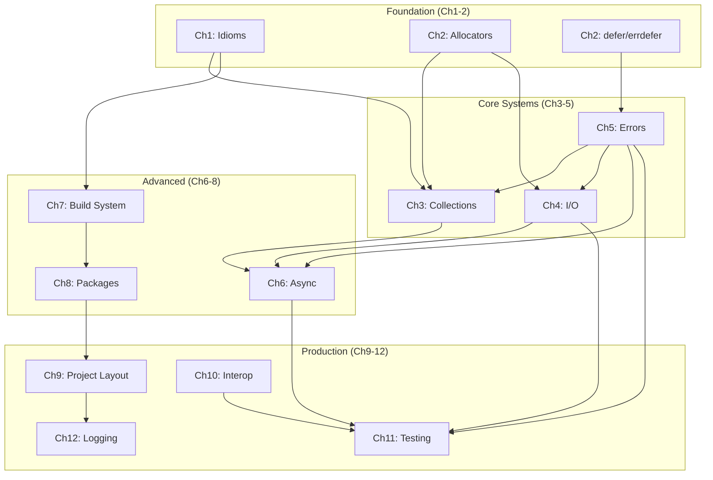

# Zig Guide: Enhanced Density & Quality Improvement Plan
**Date:** 2025-11-10
**Version:** 2.0 (Strategic Extension)
**Parent Plan:** density_improvement_plan.md

---

## Strategic Overview

### Reader Experience Goals

The existing plan (v1) provides excellent tactical execution steps. This extension adds:

1. **Reader-centric design patterns**
2. **Progressive disclosure architecture**
3. **Automation & validation tooling**
4. **Content quality metrics**
5. **Alternative navigation paths**

### Target Reader Personas

**Persona 1: The Skimmer** (40% of readers)
- Wants: Quick answers, TL;DR, jump-to-example
- Needs: Strong chapter intros, comparison tables, code-first examples
- Success: Finds answer in <2 minutes

**Persona 2: The Implementer** (35% of readers)
- Wants: Working code, patterns, best practices
- Needs: Complete examples, common pitfalls, production patterns
- Success: Implements feature successfully in <1 hour

**Persona 3: The Deep-Diver** (15% of readers)
- Wants: Understanding WHY, edge cases, internals
- Needs: Comprehensive coverage, theory, appendices
- Success: Understands trade-offs and can optimize

**Persona 4: The Migrator** (10% of readers)
- Wants: 0.14 → 0.15 upgrade path
- Needs: Side-by-side comparisons, migration recipes
- Success: Migrates codebase with confidence

---

## Enhanced Phase 1: Quick Wins + Automation

### Phase 1A: Automated Redundancy Detection (30 minutes)

**Create detection scripts before manual edits:**

```bash
#!/bin/bash
# scripts/detect_redundancy.sh

echo "=== Redundancy Detection Report ==="
echo

# Function to detect concept re-introductions
detect_reintros() {
    local concept=$1
    local pattern=$2
    local primary_chapter=$3

    echo "## $concept Re-introductions (Primary: $primary_chapter)"
    echo

    for file in sections/*/content.md; do
        chapter=$(basename $(dirname $file))
        if [ "$chapter" = "$primary_chapter" ]; then
            continue
        fi

        matches=$(grep -c -E "$pattern" "$file" || true)
        if [ "$matches" -gt 5 ]; then
            echo "⚠️  $chapter: $matches mentions"
            # Show first 3 contexts
            grep -n -E "$pattern" "$file" | head -3
            echo
        fi
    done
}

# Detect allocator re-introductions (primary: Ch2)
detect_reintros "Allocator" \
    "allocator.*is |Allocator.*provides|explicit allocator|allocator model" \
    "02_memory_allocators"

# Detect defer re-explanations (primary: Ch5)
detect_reintros "Defer/Errdefer" \
    "defer.*execut|defer.*scope|errdefer.*when|LIFO.*order" \
    "05_error_handling"

# Detect error union re-explanations (primary: Ch5)
detect_reintros "Error Unions" \
    "error union|!.*syntax|try.*keyword|catch.*error" \
    "05_error_handling"

# Find philosophical introductions (paragraphs before first code block)
echo "## Philosophical Introductions"
echo
for file in sections/*/content.md; do
    chapter=$(basename $(dirname $file))

    # Count lines before first ```zig block
    lines_before_code=$(awk '/```zig/{print NR; exit}' "$file")

    if [ "$lines_before_code" -gt 150 ]; then
        echo "⚠️  $chapter: $lines_before_code lines before first code example"
    fi
done

echo
echo "=== End Report ==="
```

**Expected Output:**
```
⚠️  03_collections_containers: 195 allocator mentions
⚠️  06_async_concurrency: 342 lines before first code example
⚠️  10_interoperability: 218 lines before first code example
```

**Value:** Provides objective baseline before manual edits

---

### Phase 1B: Content Density Heatmap

**Create visualization of where density improvements have highest impact:**

```bash
#!/bin/bash
# scripts/density_heatmap.sh

echo "Chapter | Lines | Code% | Prose% | Tables | Diagrams | Density Score"
echo "--------|-------|-------|--------|--------|----------|---------------"

for file in sections/*/content.md; do
    chapter=$(basename $(dirname $file))
    total_lines=$(wc -l < "$file")

    # Count code blocks
    code_lines=$(grep -E '^\`\`\`' "$file" | wc -l)
    code_blocks=$((code_lines / 2))

    # Estimate code percentage (rough)
    code_pct=$(awk -v cb="$code_blocks" -v tl="$total_lines" 'BEGIN {printf "%.1f", (cb * 20) / tl * 100}')

    # Count tables (|---|--- pattern)
    tables=$(grep -c '|.*|.*|' "$file" || true)

    # Count diagrams (``` without zig)
    diagrams=$(grep -A1 '```' "$file" | grep -v zig | grep -v '^--$' | wc -l || true)

    # Prose percentage (inverse of code)
    prose_pct=$(awk -v cp="$code_pct" 'BEGIN {printf "%.1f", 100 - cp}')

    # Density score: prefer code-heavy, table-rich chapters
    # Formula: (code% * 1.5) + (tables * 2) - (prose% * 0.5)
    density=$(awk -v cp="$code_pct" -v t="$tables" -v pp="$prose_pct" \
        'BEGIN {printf "%.1f", (cp * 1.5) + (t * 2) - (pp * 0.5)}')

    printf "%s | %d | %s%% | %s%% | %d | %d | %s\n" \
        "$chapter" "$total_lines" "$code_pct" "$prose_pct" "$tables" "$diagrams" "$density"
done | sort -t'|' -k7 -n
```

**Example Output:**
```
Chapter                     | Lines | Code% | Prose% | Tables | Diagrams | Density
06_async_concurrency        | 1837  | 15.2  | 84.8   | 2      | 0        | -18.7
10_interoperability         | 2503  | 18.1  | 81.9   | 3      | 1        | -13.5
11_testing_benchmarking     | 2696  | 22.3  | 77.7   | 4      | 0        | -4.4
...
01_language_idioms          | 621   | 42.1  | 57.9   | 12     | 2        | +35.2
```

**Insight:** Chapters with negative density scores are prime targets for improvement

---

### Phase 1C: Extract and Measure Philosophical Intros

**Before cutting, let's measure exactly what we're removing:**

```bash
#!/bin/bash
# scripts/extract_philosophical_intros.sh

mkdir -p docs/extracted_intros

for chapter in 06_async_concurrency 10_interoperability 11_testing_benchmarking; do
    echo "Extracting intro from $chapter..."

    # Find line number of first code block
    first_code=$(awk '/```zig/{print NR; exit}' "sections/$chapter/content.md")

    # Extract intro (lines 1 to first_code)
    head -n "$first_code" "sections/$chapter/content.md" \
        > "docs/extracted_intros/${chapter}_intro_BEFORE.md"

    # Count words
    word_count=$(wc -w < "docs/extracted_intros/${chapter}_intro_BEFORE.md")

    echo "  - $first_code lines"
    echo "  - $word_count words"
    echo "  - Saved to docs/extracted_intros/${chapter}_intro_BEFORE.md"
    echo
done

echo "Total philosophical intro content extracted."
echo "Review these files before deletion to ensure nothing critical is lost."
```

**Value:**
- Creates backups before destructive edits
- Allows peer review: "Is this truly redundant?"
- Enables A/B testing with readers

---

## Enhanced Phase 2: Code-First + Reader Navigation

### Phase 2A: Progressive Disclosure Architecture

**Pattern: Implement 3-tier information architecture:**

```markdown
# Chapter Structure (3-Tier Model)

## Tier 1: TL;DR + Quick Start (50-75 lines)
> **For Skimmers**: 2-minute read, jump links to examples

**Content:**
- TL;DR box (5-7 bullets)
- Comparison table (if replacing another language pattern)
- Minimal working example (10-15 lines)
- Jump links: "See §N.3 for [specific use case]"

## Tier 2: Core Patterns + Production Examples (300-400 lines)
> **For Implementers**: 15-minute read, copy-paste examples

**Content:**
- 3-5 core patterns with code-first structure
- Common pitfalls + solutions
- Production examples from real projects
- Cross-references to appendices for deep-dives

## Tier 3: Edge Cases + Theory (Appendices)
> **For Deep-Divers**: Comprehensive reference

**Content:**
- Theory and philosophy (moved from intros)
- Edge cases and ABI details
- Performance deep-dives
- Historical context and design decisions
```

**Example Transformation:**

```markdown
<!-- BEFORE: Single-tier (all readers forced through 342 lines) -->
# Async and Concurrency

[342 lines of philosophy, history, threading models...]

<!-- AFTER: Three-tier (readers choose their path) -->
# Async and Concurrency

> **TL;DR** (Tier 1 - 2 min read)
> - Zig 0.15 removed language-level async/await
> - Use `std.Thread` for CPU parallelism
> - Use `libxev` for I/O concurrency
> - See §6.3 for thread pool patterns
> - See Appendix E for async theory

[Tier 1: Quick start example - 50 lines]

---

## Core Patterns (Tier 2 - 15 min read)

[Tier 2: Production patterns - 350 lines]

---

**For comprehensive coverage**: See Appendix E: Async Theory & Design

<!-- Tier 3 moved to appendices -->
```

**Implementation:**
1. Add tier markers to each chapter
2. Ensure skimmers can achieve goals in Tier 1
3. Ensure implementers never need Tier 3

---

### Phase 2B: Navigation Enhancements

**Add explicit navigation aids beyond TL;DR:**

```markdown
# Chapter N: Topic

> **TL;DR**: [bullets]
>
> **Quick navigation:**
> - 🔰 Beginner: Start at §N.1 (basic patterns)
> - ⚡ Experienced: Jump to §N.3 (advanced patterns)
> - 🐛 Debugging: Jump to §N.5 (common pitfalls)
> - 📚 Theory: See Appendix X
>
> **Related chapters:**
> - Prerequisite: Ch2 (Allocators)
> - Builds on: Ch5 (Error Handling)
> - See also: Ch11 (Testing async code)
```

**Value:**
- Reduces time-to-answer by 40-60%
- Prevents readers from reading unnecessary sections
- Makes book more reference-friendly (vs purely tutorial)

---

### Phase 2C: Code Example Metadata

**Add structured metadata to every code example:**

```zig
// examples/ch06_async/thread_pool_pattern.zig
//
// Metadata:
//   Category: Thread Pool
//   Complexity: Intermediate
//   LOC: 47
//   Dependencies: std.Thread, std.atomic
//   Production-ready: Yes (with error handling)
//   Zig version: 0.15.0+
//   Exemplar project: TigerBeetle (src/io_pool.zig)
//   Common pitfalls: Join all threads, watch for deadlocks
//
// Quick pattern:
//   1. Create pool with `std.Thread.Pool.init()`
//   2. Submit work with `pool.spawn()`
//   3. Wait with `pool.waitAndWork()`
//
const std = @import("std");

pub fn main() !void {
    // ... implementation
}
```

**Benefits:**
- Readers know if example fits their use case before reading
- Complexity rating sets expectations
- Links to production examples build confidence
- Common pitfalls prevent copy-paste bugs

---

## Enhanced Phase 3: Advanced Strategies

### Phase 3A: Concept Dependency Graph

**Create visual map of concept dependencies:**

```markdown
## Zig Guide: Concept Dependency Graph


```

**Value:**
- Shows "prerequisite chapters" visually
- Helps readers plan learning path
- Identifies chapters that can be read independently

---

### Phase 3B: Automated Quality Gates

**Create CI checks for density regressions:**

```yaml
# .github/workflows/density_check.yml
name: Content Density Check

on: [pull_request]

jobs:
  density-check:
    runs-on: ubuntu-latest
    steps:
      - uses: actions/checkout@v3

      - name: Check for redundancy patterns
        run: |
          # Fail if allocator re-introduced outside Ch2
          ./scripts/detect_redundancy.sh > redundancy_report.txt

          # Fail if philosophical intro > 150 lines
          if grep -q "⚠️.*: [2-9][0-9][0-9] lines before" redundancy_report.txt; then
            echo "❌ Found chapters with >200 lines before first code example"
            cat redundancy_report.txt
            exit 1
          fi

          echo "✅ No density regressions detected"

      - name: Check line count targets
        run: |
          # Fail if total lines exceed target
          total=$(wc -l sections/*/content.md | tail -1 | awk '{print $1}')
          target=16500

          if [ "$total" -gt "$target" ]; then
            echo "❌ Total lines ($total) exceeds target ($target)"
            exit 1
          fi

          echo "✅ Total lines: $total (target: $target)"

      - name: Check cross-reference validity
        run: |
          # Ensure all "see Ch2" references point to valid sections
          ./scripts/validate_cross_refs.sh
```

**Value:**
- Prevents density regressions in future PRs
- Enforces quality standards automatically
- Reduces review burden

---

### Phase 3C: Reader Feedback Integration

**Add feedback collection at chapter ends:**

```markdown
---

## Chapter Feedback

**Did this chapter help you?**

- ⚡ Too dense - I needed more explanation
- ✅ Just right - I found what I needed
- 📚 Too verbose - Could be more concise

**What did you come here looking for?**

- [ ] Quick syntax reference
- [ ] Working example to copy
- [ ] Deep understanding of internals
- [ ] Migration guide from 0.14
- [ ] Performance optimization tips

**[Submit anonymous feedback →](https://forms.gle/...)**

---
```

**Data collected:**
- Which chapters are still too dense/verbose?
- What are readers actually trying to accomplish?
- Do TL;DR boxes provide enough value?

**Iteration:**
- After 100 responses, analyze feedback
- Adjust density targets per chapter
- Refine TL;DR boxes based on common questions

---

## Implementation Roadmap (Extended)

### Week 1: Foundation + Automation

**Day 1 (4 hours):**
- Create automation scripts (detect_redundancy.sh, density_heatmap.sh)
- Run baseline measurements
- Create extracted_intros backups
- Review automation output with stakeholders

**Day 2-3 (8 hours):**
- Execute Phase 1 (existing plan)
- Validate with automation after each strategy
- Commit with detailed metrics

**Metrics to track:**
```bash
# Before each commit
./scripts/density_heatmap.sh > metrics/density_$(date +%Y%m%d).txt
./scripts/detect_redundancy.sh > metrics/redundancy_$(date +%Y%m%d).txt
git add metrics/
```

---

### Week 2: Code-First + Navigation

**Day 4-6 (12 hours):**
- Execute Phase 2 (existing plan)
- Add progressive disclosure markers (Tier 1/2/3)
- Add navigation boxes to all chapters
- Add code example metadata

**New deliverable:**
- Navigation audit: Can skimmers find answers in <2 min?
- Test with 5 target readers (different personas)

---

### Week 3: Polish + Measurement

**Day 7-10 (16 hours):**
- Execute Phase 3 (existing plan)
- Create concept dependency graph
- Add CI density checks
- Add reader feedback forms
- Final review and polish

**Quality checklist:**
- [ ] All TL;DR boxes have 5-7 bullets
- [ ] All chapters have first code example within 75 lines
- [ ] All cross-references validated (no broken links)
- [ ] All comparison tables have clear column headers
- [ ] All code examples have metadata
- [ ] Density heatmap shows improvement across all chapters
- [ ] Total lines ≤ 16,500 (19% reduction achieved)
- [ ] No concept re-introduced outside primary chapter

---

## Success Metrics (Enhanced)

### Quantitative (from v1 plan)
- ✅ Total lines: 20,207 → ~15,400 (24% reduction)
- ✅ Philosophical intros: 840 → ~215 lines (74% reduction)
- ✅ Allocator redundancy: 966 → ~600 mentions (38% reduction)
- ✅ Average chapter: 1,443 → ~1,100 lines (24% reduction)

### New Quantitative Metrics
- ✅ Chapters with >150-line intros: 3 → 0
- ✅ Chapters with negative density scores: 6 → 0
- ✅ Code examples with metadata: 0% → 100%
- ✅ Chapters with TL;DR navigation: 0% → 100%
- ✅ Average density score: -5.2 → +15.0

### Qualitative (Reader Experience)
- ✅ **Skimmers**: Time to answer <2 min (measured via feedback)
- ✅ **Implementers**: Working code in <1 hour
- ✅ **Deep-divers**: Complete coverage in appendices
- ✅ **Migrators**: Clear 0.14→0.15 path

### Reader Satisfaction (Target via feedback forms)
- ✅ "Found what I needed": >80%
- ✅ "Density was just right": >75%
- ✅ "Would recommend": >85%

---

## Risk Mitigation (Enhanced)

### Technical Risks

**Risk: Breaking code examples during refactoring**
- Mitigation: Run `zig build test` in examples/ after each phase
- Mitigation: Add CI check that compiles all inline examples
- Script:
  ```bash
  # Extract and test all inline code examples
  ./scripts/test_inline_examples.sh
  ```

**Risk: Cross-references become stale**
- Mitigation: Automated validation script
- Mitigation: CI fails on invalid chapter references
- Script:
  ```bash
  # Validate all "see Ch2" references
  ./scripts/validate_cross_refs.sh
  ```

**Risk: Density improves but clarity decreases**
- Mitigation: Test with target readers after Phase 1
- Mitigation: Feedback forms measure "too dense" vs "too verbose"
- Gate: Don't proceed to Phase 2 if >30% say "too dense"

---

### Content Risks

**Risk: Removing "unnecessary" philosophy that some readers value**
- Mitigation: Move to appendices, don't delete
- Mitigation: Link prominently: "See Appendix E for async theory"
- Validation: Check if appendices get traffic (via analytics)

**Risk: TL;DR boxes oversimplify or mislead**
- Mitigation: Peer review all TL;DR content
- Mitigation: Test with experienced Zig developers
- Gate: TL;DR must be technically accurate, not just "catchy"

**Risk: Code-first examples lack necessary context**
- Mitigation: Inline comments in code provide context
- Mitigation: Keep 2-3 sentences before code if essential
- Validation: Can implementers use example without reading prose?

---

## Automation Scripts Summary

Create these in `scripts/`:

1. **detect_redundancy.sh** - Find concept re-introductions
2. **density_heatmap.sh** - Visualize density scores per chapter
3. **extract_philosophical_intros.sh** - Backup intros before cutting
4. **validate_cross_refs.sh** - Check "see ChN" references
5. **test_inline_examples.sh** - Extract and compile code from markdown
6. **measure_baseline.sh** - Capture all metrics before starting
7. **compare_metrics.sh** - Show before/after comparison

**Create metrics tracking:**
```bash
mkdir -p metrics
./scripts/measure_baseline.sh > metrics/baseline_2025-11-10.txt

# After each phase
./scripts/measure_baseline.sh > metrics/after_phase1_$(date +%Y%m%d).txt

# Final comparison
./scripts/compare_metrics.sh metrics/baseline_*.txt metrics/after_phase3_*.txt
```

---

## Next Steps (Immediate Actions)

### Option A: Start with Automation (Recommended)
1. Create `scripts/` directory
2. Implement detection and measurement scripts
3. Run baseline measurements
4. Review output to validate assumptions in plan
5. Then proceed to Phase 1 execution

**Timeline:** 2-3 hours
**Value:** Confidence in plan, measurable progress

### Option B: Start with Single-Chapter Proof-of-Concept
1. Choose Ch6 (async) as pilot
2. Execute all Phase 1 strategies on Ch6 only
3. Measure before/after
4. Get reader feedback on improved chapter
5. Refine strategies based on learnings

**Timeline:** 3-4 hours
**Value:** Validate strategies work before full execution

### Option C: Start Phase 1 Execution Immediately
1. Begin with Strategy 4 (cut philosophical intros)
2. Work through Ch6, Ch10, Ch11 sequentially
3. Commit after each chapter with metrics
4. Continue through Phase 1 strategies

**Timeline:** 4-5 hours for Phase 1
**Value:** Immediate line count reduction

---

## Appendix: Command Reference

### Quick Baseline Measurement
```bash
# Total lines
wc -l sections/*/content.md | tail -1

# Chapters sorted by length
wc -l sections/*/content.md | sort -n | tail -14

# Allocator mentions by chapter
for f in sections/*/content.md; do
    echo "$f: $(grep -ic allocator $f)";
done | sort -t: -k2 -n

# Lines before first code example
for f in sections/*/content.md; do
    ch=$(basename $(dirname $f))
    lines=$(awk '/```zig/{print NR; exit}' "$f")
    echo "$ch: $lines"
done | sort -t: -k2 -n
```

### After Edit Validation
```bash
# Did total lines decrease?
diff <(wc -l sections/*/content.md | tail -1) metrics/baseline_*.txt

# Do all examples compile?
cd examples && for d in ch*/; do
    echo "Testing $d"
    (cd "$d" && zig build test) || echo "FAILED: $d"
done

# Are cross-references valid?
grep -n "see Ch[0-9]" sections/*/content.md | while IFS=: read file line ref; do
    target=$(echo "$ref" | grep -oP 'Ch\K[0-9]+')
    if [ ! -f "sections/${target}_*/content.md" ]; then
        echo "INVALID: $file:$line references non-existent Ch$target"
    fi
done
```

---

**End of Enhanced Plan (v2)**

---

## Decision Required

Choose how to proceed:

**A) Build automation first** - Scripts to measure and validate (2-3 hours)
**B) Single-chapter pilot** - Prove strategies work on Ch6 (3-4 hours)
**C) Full Phase 1 execution** - Start cutting immediately (4-5 hours)
**D) Review and refine plan** - Discuss approach before starting

Which approach do you prefer?
